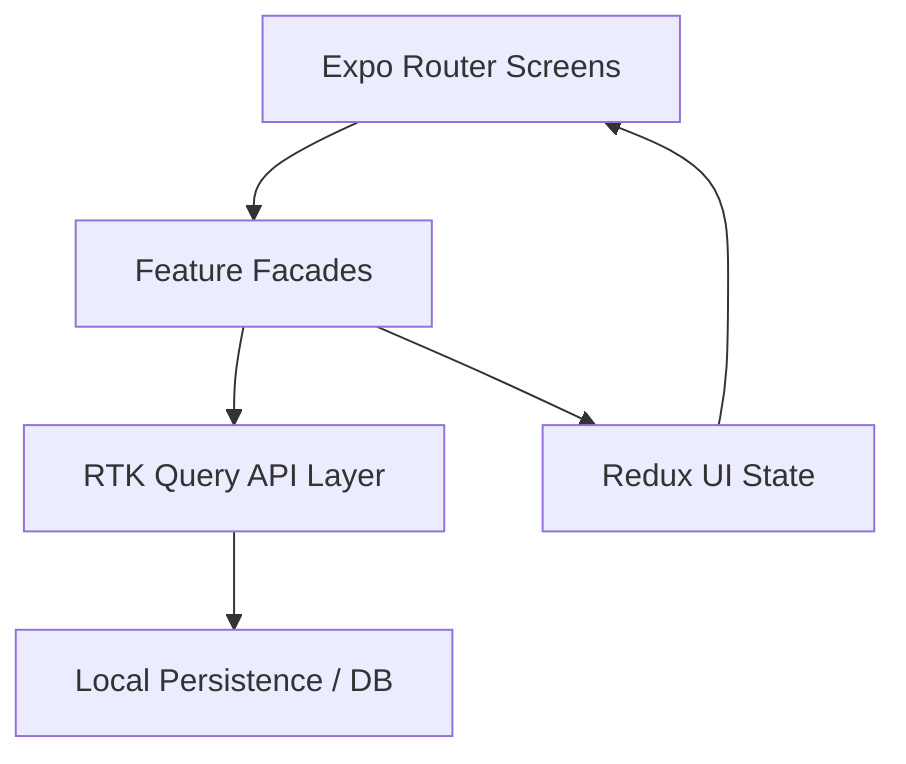

# MoveTask App

MoveTask is a mobile-first task management app built with Expo + React Native.  
It helps users organize work into projects, manage tasks by status/priority, and track what is due today.

## Core Features

- Authentication flow (`sign in`, `sign up`, persisted session)
- Project management (create, delete, reorder)
- Task management inside projects
  - Create, update, delete
  - Move tasks across statuses (`todo`, `in_progress`, `done`)
  - Tags, due date, priority
- Board and list views for project tasks
- Today view (tasks due today or overdue)
- Filtering/search for task lists
- Themed UI (light/dark/system) with shared design tokens
- Android-specific UX polish
  - Transparent header content padding fixes
  - Centered header titles
  - Custom themed Android date picker modal

## Architecture

The app follows a modular feature-first architecture with clear separation of concerns:

- **UI Layer**: Expo Router screens + reusable UI components in `src/shared/ui`
- **Application Layer**: Feature facades and use-cases in `src/modules/*/application`
- **Domain Layer**: Feature entities/types in `src/modules/*/domain`
- **Data Layer**: RTK Query + local persistence abstractions
- **State Layer**: Redux Toolkit store and slices

### High-level Flow



### Routing Layout Structure

The app uses nested route-group layouts to scope navigator behavior:

- `app/(auth)/_layout.tsx` -> auth stack
- `app/(app)/(tabs)/_layout.tsx` -> main tab navigator
- `app/(app)/(tabs)/projects/_layout.tsx` -> projects stack
- `app/(app)/(tabs)/projects/[projectId]/_layout.tsx` -> per-project stack

This allows each route branch to have targeted header options, screen transitions, and actions.

## Tech Stack

- **Framework**: Expo, React Native, React
- **Routing**: `expo-router`
- **State/Data**: `@reduxjs/toolkit`, `react-redux` (RTK Query)
- **Storage/DB**: `@nozbe/watermelondb`, `@react-native-async-storage/async-storage`
- **UI/UX**:
  - `expo-linear-gradient`
  - `@expo/vector-icons`
  - `@react-native-community/datetimepicker`
  - `react-native-safe-area-context`
  - `react-native-gesture-handler`
  - `react-native-reanimated`
  - `react-native-draggable-flatlist`
- **Tooling**: TypeScript, ESLint, Prettier, Jest, Husky, lint-staged

## Project Structure

```text
app/                      # Expo Router screens/layouts
src/
  modules/
    auth/
    projects/
    tasks/
  shared/
    ui/                   # Reusable components
    theme/                # Tokens, gradients, theme context
    lib/                  # Shared helpers/hooks
store/                    # Redux store + RTK API
```

## Getting Started

### Prerequisites

- Node.js (LTS recommended)
- npm
- Xcode (iOS) or Android Studio (Android)

### Install

```bash
npm install
```

### Run

```bash
npm run start
```

Then open:

- `npm run android` for Android
- `npm run ios` for iOS
- `npm run web` for web

## Quality & Testing

```bash
npm run lint
npm run format:check
npm run test
```

## Notes

- Headers are transparent and themed; content spacing is handled explicitly to avoid overlap.
- Android uses a custom in-app date picker modal for consistent app styling.
